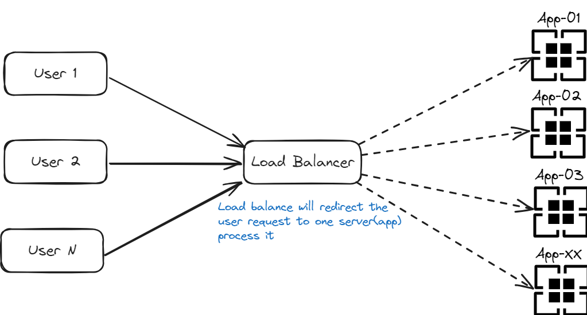

# Load Balancer

It's a symbolic project to learn about load balancer solution.

**High level how load balancer works:**



## Dependencies

- [Node](https://nodejs.org/en)
- [Nginx](https://nginx.org/en/)
- [Docker](https://www.docker.com/)
- [Docker Compose](https://docs.docker.com/compose/)

## Setup


```shell
# Don't set -d arg if you want to see the logger when running the command to test
docker-compose up
```


## Tests

```shell
watch -n 0 'curl -s -o /dev/null http://localhost:8080 &'
```

*Now, you can see the logs of docker compose if you not set `-d` argument to run docker-compose*
